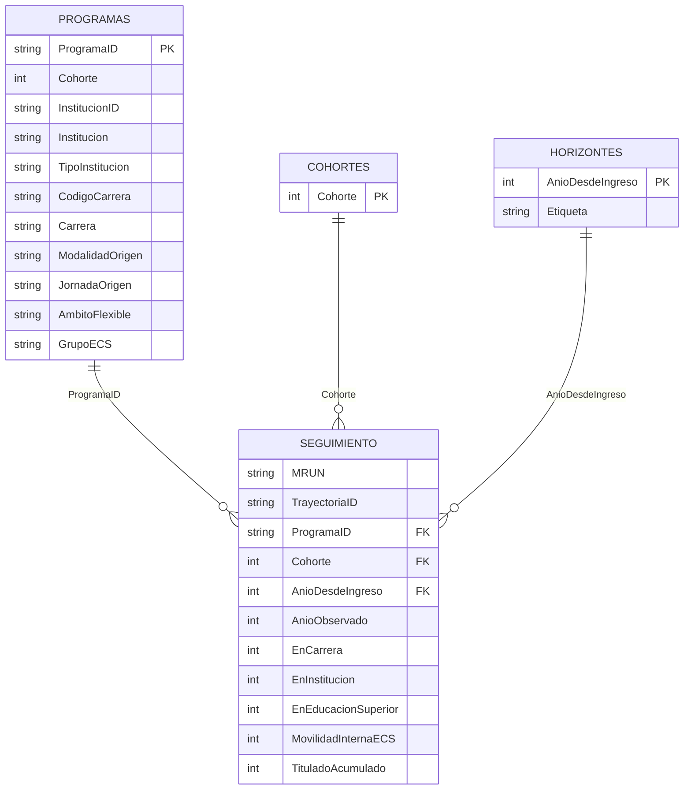

# Auditoría exhaustiva del modelo semántico y DAX

> **Estado posterior (versión 3.1.0, 12-09-2026):** este documento conserva el diagnóstico histórico de la versión 3.0.0. Los hallazgos DAX-001 y REPORT-001 fueron corregidos: las medidas exigen una cohorte y un horizonte únicos, y el reporte contiene 73 visuales sin colisiones. `Ruta datos` también fue corregida con una ruta absoluta existente para la copia local. La evidencia vigente está en [AUDITORIA_NUMERICA_COMPLETA.md](AUDITORIA_NUMERICA_COMPLETA.md) y [VALIDACION.md](VALIDACION.md).

**Proyecto:** `Retencion_Academica_SIES.pbip`
**Fecha:** 11 de septiembre de 2026
**Modalidad:** revisión estática del PBIP y perfilado completo de sus CSV analíticos
**Estado general:** funcionalmente coherente en su grano y relaciones; requiere corregir dos riesgos altos de interacción antes de considerarlo cerrado visualmente.

## Convenciones de esta auditoría

- **Hecho observado:** comprobado directamente en TMDL, JSON del informe, scripts o CSV.
- **Inferencia:** conclusión técnica fundada, pero que requiere Power BI Desktop, TOM o DAX Studio para confirmación dinámica.
- **Recomendación:** cambio propuesto; no se aplicó durante esta auditoría.
- Severidad: **Crítico**, **Alto**, **Medio** o **Bajo**.

No se encontraron hallazgos críticos en integridad del modelo o exactitud de las tres tasas. Se encontraron dos hallazgos altos en el comportamiento de filtros y generación de visuales.

---

# 1. Resumen ejecutivo: diez hallazgos principales

| # | Severidad | Tipo | Hallazgo | Impacto principal |
|---:|---|---|---|---|
| 1 | Alto | Hecho | Las medidas base convierten una selección múltiple de cohorte u horizonte en los valores predeterminados 2024/2 mediante `COALESCE(SELECTEDVALUE())` y luego intersectan con `KEEPFILTERS`. | Una selección `{2023, 2024}` devuelve sólo 2024; `{2022, 2023}` puede devolver blanco, sin advertir al usuario. |
| 2 | Alto | Hecho | Existen tres colisiones de identificadores en el generador de visuales. | Se perdieron los segmentadores Cohorte en Resumen y ECS, y Ámbito flexible en Modalidad y jornada. Hay 70 visuales en vez de los 73 definidos lógicamente. |
| 3 | Medio | Hecho | Nueve medidas realizan `DISTINCTCOUNT` sobre llaves de texto; `TrayectoriaID` tiene 307.477 valores y `MRUN` 283.350. | Mayor tamaño de diccionario y costo de Storage Engine que una clave entera o `COUNTROWS`/`SUM` en el grano garantizado. |
| 4 | Medio | Hecho | `Folder.Files` incorpora recursivamente cualquier archivo cuyo nombre cumpla `seguimiento_*.csv.gz`, sin validar esquema, año ni duplicados. | Una copia accidental en una subcarpeta puede duplicar el hecho o romper el refresco. |
| 5 | Medio | Hecho | No hay descripciones TMDL; todas las medidas están en una única carpeta y varias banderas técnicas permanecen visibles. | Menor gobernanza y mayor riesgo de que un autor use directamente campos técnicos. |
| 6 | Medio | Hecho | La lectura por personas usa semántica existencial: un `MRUN` con varias trayectorias cuenta como retenido si al menos una tiene la bandera. | Puede interpretarse erróneamente como retención de todas sus trayectorias. |
| 7 | Medio | Hecho | `Ruta datos` conserva el marcador `marcador de ruta sin configurar`. | El primer refresco falla hasta configurar el parámetro; es portable, pero no auto-configurable. |
| 8 | Bajo | Hecho | Las medidas de numeradores contienen `CALCULATE(CALCULATE(...))` y repiten nueve veces la misma lógica de contexto predeterminado. | DAX más difícil de mantener; el `CALCULATE` interior no aporta valor estructural. |
| 9 | Bajo | Hecho | `Observable` es constante 1; `Definicion MRUN` no tiene consumidores. `EnECS` y otros campos tampoco participan en medidas o visuales actuales. | Objetos sin valor operativo y ruido en el modelo. |
| 10 | Bajo | Falta de evidencia | No se dispone de Power BI Desktop, DAX Studio ni conexión XMLA en el entorno de auditoría. | No se pueden afirmar tiempos, tamaño VertiPaq, porcentaje FE/SE ni estado efectivo serializado por TOM. |

Fortalezas relevantes:

- Las tres relaciones conciliaron sin claves huérfanas ni duplicados en el lado uno.
- No existen relaciones bidireccionales, many-to-many, rutas ambiguas ni dependencias DAX circulares.
- Las medidas de tasa usan `DIVIDE`.
- Los filtros DAX son predicados simples; no existen `FILTER` sobre la tabla grande, iteradores anidados ni relaciones virtuales.
- Para todas las agregaciones de control se cumple `académica ≤ institucional ≤ educación superior`.

---

# 2. Inventario de archivos y objetos analizados

## 2.1 Archivos TMDL leídos

| Archivo | Estado | Contenido |
|---|---|---|
| `definition/model.tmdl` | Leído | Modelo, cultura y referencias a cuatro tablas. |
| `definition/relationships.tmdl` | Leído | Tres relaciones. |
| `definition/expressions.tmdl` | Leído | Parámetro M `Ruta datos`. |
| `definition/database.tmdl` | Leído | Nivel de compatibilidad 1606. |
| `definition/tables/Seguimiento.tmdl` | Leído | 13 columnas, 20 medidas y una partición M. |
| `definition/tables/Programas.tmdl` | Leído | 14 columnas y una partición M. |
| `definition/tables/Cohortes.tmdl` | Leído | Una columna y una partición M. |
| `definition/tables/Horizontes.tmdl` | Leído | Dos columnas y una partición M. |
| `definition/cultures/es-CL.tmdl` | Leído | Declaración mínima de cultura. |
| `definition/roles/*.tmdl` | No existe | No hay RLS/OLS. |
| `definition/calculationGroups/*.tmdl` | No existe | No hay grupos de cálculo. |

También se inspeccionaron `definition.pbir`, `report.json`, `pages.json`, los 70 `visual.json`, los scripts generadores y todos los CSV analíticos.

## 2.2 Tablas

| Tabla | Tipo | Filas | Columnas | Medidas | Grano |
|---|---|---:|---:|---:|---|
| `Seguimiento` | Hecho importado | 1.634.184 | 13 | 20 | Una fila por `TrayectoriaID` y `AnioObservado`. |
| `Programas` | Dimensión importada | 3.152 | 14 | 0 | Un registro por `ProgramaID`, que incorpora cohorte, modalidad y jornada de origen. |
| `Cohortes` | Dimensión importada | 15 | 1 | 0 | Un registro por cohorte 2011–2025. |
| `Horizontes` | Dimensión importada | 15 | 2 | 0 | Un registro por año desde ingreso 1–15. |

## 2.3 Columnas

| Tabla | Columna | Tipo TMDL | Cardinalidad | Nulos/blancos | Oculta | Uso actual |
|---|---|---|---:|---:|---|---|
| Seguimiento | `MRUN` | string | 283.350 | 0 | Sí | `DISTINCTCOUNT` de personas. |
| Seguimiento | `TrayectoriaID` | string | 307.477 | 0 | Sí | Base y numeradores por trayectoria. |
| Seguimiento | `ProgramaID` | string | 3.152 | 0 | Sí | Relación con Programas. |
| Seguimiento | `Cohorte` | int64 | 15 | 0 | No | Relación con Cohortes. |
| Seguimiento | `AnioObservado` | int64 | 15 | 0 | No | Sin consumidor actual. |
| Seguimiento | `AnioDesdeIngreso` | int64 | 15 | 0 | No | Relación con Horizontes. |
| Seguimiento | `Observable` | int64 | 1 | 0 | No | Constante 1; sin consumidor. |
| Seguimiento | `EnCarrera` | int64 | 2 | 0 | No | Filtro de `N Carrera`. |
| Seguimiento | `EnInstitucion` | int64 | 2 | 0 | No | Filtro de medidas institucionales. |
| Seguimiento | `EnEducacionSuperior` | int64 | 2 | 0 | No | Filtro de permanencia en ES. |
| Seguimiento | `EnECS` | int64 | 2 | 0 | No | Sin consumidor actual. |
| Seguimiento | `MovilidadInternaECS` | int64 | 2 | 0 | No | Filtro de movilidad ECS. |
| Seguimiento | `TituladoAcumulado` | int64 | 2 | 0 | No | Filtro de titulación. |
| Programas | `ProgramaID` | string | 3.152 | 0 | Sí | Lado uno de la relación. |
| Programas | `Cohorte` | int64 | 15 | 0 | No | Redundante respecto de Dim Cohortes; sin visual actual. |
| Programas | `InstitucionID` | string | 48 | 0 | Sí | Identificador técnico; sin visual. |
| Programas | `Institucion` | string | 48 | 0 | No | Tablas Instituciones y ECS. |
| Programas | `TipoInstitucion` | string | 2 | 0 | No | Segmentadores. |
| Programas | `CodigoCarrera` | string | 405 | 0 | No | Sin visual actual. No es clave global. |
| Programas | `Carrera` | string | 469 | 0 | No | Sin visual actual. |
| Programas | `Nivel` | string | 2 | 0 | No | Sin visual actual. |
| Programas | `Area` | string | 10 | 0 | No | Sin visual actual. |
| Programas | `ModalidadOrigen` | string | 3 | 0 | No | Sin visual actual. |
| Programas | `JornadaOrigen` | string | 6 | 0 | No | Página Modalidad y jornada. |
| Programas | `AmbitoFlexible` | string | 3 | 0 | No | Segmentadores, gráfico y tabla. |
| Programas | `GrupoECS` | string | 2 | 0 | No | Filtro interno de medidas ECS. |
| Programas | `RegistrosOrigen` | int64 | 449 | 0 | No | Sin consumidor actual. |
| Cohortes | `Cohorte` | int64 | 15 | 0 | No | Ejes, tabla y segmentadores. |
| Horizontes | `AnioDesdeIngreso` | int64 | 15 | 0 | No | Segmentadores. |
| Horizontes | `Etiqueta` | string | 15 | 0 | No | Sin consumidor actual; tampoco tiene `sortByColumn`. |

No hay columnas calculadas, tablas calculadas, jerarquías ni categorías de datos declaradas.

## 2.4 Particiones y Power Query

| Partición | Origen | Observación |
|---|---|---|
| Seguimiento | `Folder.Files(Ruta datos)` + GZip + CSV | Combina recursivamente nombres `seguimiento_*.csv.gz`; una sola partición del modelo. |
| Programas | `programas.csv` | CSV UTF-8 separado por `;`. |
| Cohortes | `cohortes.csv` | CSV UTF-8 separado por `;`. |
| Horizontes | `horizontes.csv` | CSV UTF-8 separado por `;`. |

Evidencia: `Seguimiento.tmdl:189-198`, `Programas.tmdl:75-82`, `Cohortes.tmdl:8-15`, `Horizontes.tmdl:13-20` y `expressions.tmdl:1`.

## 2.5 Informe y consumo

| Página | Visuales efectivos | Objetos principales |
|---|---:|---|
| Resumen nacional | 12 | 4 tarjetas, línea por cohorte, tabla de personas, 3 segmentadores. |
| Cohortes | 8 | Línea, tabla y 4 segmentadores. |
| Instituciones | 8 | Tabla y 4 segmentadores. |
| Modalidad y jornada | 8 | 2 columnas, tabla y 3 segmentadores. |
| ECS | 11 | 4 tarjetas, tabla y 3 segmentadores. |
| Titulación | 11 | 3 tarjetas, tabla y 4 segmentadores. |
| Metodología | 12 | Textos explicativos. |

La definición pretendía cuatro segmentadores en las seis páginas analíticas. Tres fueron sobrescritos por colisiones de identificador; véase el hallazgo REL/VIS-01.

---

# 3. Diagrama ER



El diseño es un esquema estrella pequeño. `Programas` está a nivel programa–cohorte–modalidad/jornada, no a nivel de un catálogo histórico de programa puro.

---

# 4. Matriz completa de relaciones

Las propiedades cardinalidad, actividad, filtro cruzado, filtro de seguridad e integridad referencial no están serializadas explícitamente en `relationships.tmdl`. La matriz distingue lo observado de lo inferido por el patrón estándar many-to-one de TMDL y el perfil de datos. Debe confirmarse el valor efectivo con TOM o Power BI Desktop.

| ID | Desde | Hacia | Cardinalidad respaldada por datos | Filtro esperado | Activa | Integridad | Columna calculada | Ambigüedad |
|---|---|---|---|---|---|---|---|---|
| `a119…f08` | Seguimiento[ProgramaID] | Programas[ProgramaID] | N:1; 1.634.184 filas → 3.152 claves únicas | Una dirección, Programas → Seguimiento | Inferida: sí | 0 huérfanos, 0 nulos; propiedad RI no declarada | No | No |
| `fa14…a5` | Seguimiento[Cohorte] | Cohortes[Cohorte] | N:1; 15 valores → 15 claves únicas | Una dirección, Cohortes → Seguimiento | Inferida: sí | 0 huérfanos, 0 nulos; RI no declarada | No | No |
| `1604…fe` | Seguimiento[AnioDesdeIngreso] | Horizontes[AnioDesdeIngreso] | N:1; 15 valores → 15 claves únicas | Una dirección, Horizontes → Seguimiento | Inferida: sí | 0 huérfanos, 0 nulos; RI no declarada | No | No |

Evidencia de definición: `relationships.tmdl:1-11`. Evidencia de unicidad e integridad: perfilado de todos los CSV; también está automatizada parcialmente en `tests/test_reproducibilidad.py`.

---

# 5. Hallazgos del modelo de relaciones

## REL-01 — Propiedades efectivas no explicitadas

- **Severidad:** Medio.
- **Tipo:** Hecho e inferencia.
- **Evidencia:** `relationships.tmdl:1-11` sólo contiene `fromColumn` y `toColumn`.
- **Impacto:** La lectura humana no puede comprobar directamente cardinalidad, actividad y filtro cruzado. El perfil respalda N:1, pero la configuración efectiva requiere deserialización TOM.
- **Recomendación:** validar con Power BI Desktop/Tabular Editor y registrar en la auditoría generada por CI: `fromCardinality=Many`, `toCardinality=One`, `crossFilteringBehavior=OneDirection`, `isActive=true`.
- **Alternativa:** mantener el TMDL mínimo si el serializador elimina valores predeterminados, pero agregar un test TOM en un runner que tenga las bibliotecas de Analysis Services.
- **Riesgo del cambio:** forzar propiedades no reconocidas por la versión de Desktop podría impedir abrir el proyecto; debe serializarse mediante TOM, no editarse a ciegas.

## REL-02 — Modelo estrella correcto

- **Severidad:** Bajo/positivo.
- **Tipo:** Hecho observado.
- **Evidencia:** sólo existen tres relaciones desde dimensiones al hecho; no hay rutas alternativas.
- **Conclusión:** no hay copo de nieve, ciclos, bidireccionalidad, many-to-many, bridges ni tablas huérfanas.
- **Recomendación:** conservar la dirección única. No introducir filtros bidireccionales para resolver necesidades visuales.

## REL-03 — Cohorte duplicada como atributo en Programas

- **Severidad:** Medio.
- **Tipo:** Hecho observado.
- **Evidencia:** `Programas.tmdl:9-12` y `Seguimiento.tmdl:139-152`.
- **Impacto:** un autor puede usar accidentalmente `Programas[Cohorte]` en vez de `Cohortes[Cohorte]`. Ambas coinciden actualmente —0 filas inconsistentes—, pero sólo la segunda es la dimensión oficial.
- **Recomendación:** ocultar o retirar `Programas[Cohorte]`; mantener una única superficie de filtrado temporal.
- **Alternativa:** relacionar Cohortes con Programas no es recomendable porque crearía una segunda ruta hacia Seguimiento.
- **Riesgo:** retirar la columna exige verificar que scripts o futuras páginas no la consuman.

## REL-04 — No existe dimensión de fecha

- **Severidad:** No aplica actualmente.
- **Tipo:** Hecho observado.
- **Evidencia:** sólo existen Cohortes y Horizontes; no hay funciones de inteligencia temporal.
- **Conclusión:** la granularidad es anual y las medidas comparan cohortes/horizontes, no fechas. Una tabla calendario diaria agregaría complejidad sin beneficio actual.
- **Recomendación:** crear una dimensión `PeriodoAcademico` sólo si se incorporan fechas, meses, cortes o medidas `DATEADD`/YTD.

## REL-05 — Código de carrera no es clave global

- **Severidad:** Bajo.
- **Tipo:** Hecho observado.
- **Evidencia:** Programas contiene 405 códigos y 469 nombres en 48 instituciones; la relación usa correctamente `ProgramaID`.
- **Impacto:** filtrar únicamente `CodigoCarrera` puede agrupar carreras de instituciones distintas.
- **Recomendación:** describirlo como atributo local y exponer una etiqueta compuesta Institución–Código–Carrera cuando se incorpore a visuales.

---

# 6. Inventario DAX completo

Todas las medidas están en `Seguimiento.tmdl:3-119`, poseen `formatString` y pertenecen a `Indicadores reproducibles`. Ninguna tiene `description`.

| Medida | Expresión lógica completa | Dependencias | Uso visual directo |
|---|---|---|---:|
| `N Base` | `DISTINCTCOUNT(TrayectoriaID)` dentro del contexto predeterminado | Cohortes, Horizontes | 8 |
| `N Carrera` | `DISTINCTCOUNT(TrayectoriaID)` con `EnCarrera=1` y contexto predeterminado | Ninguna medida | 0 |
| `N Institucion` | Igual con `EnInstitucion=1` | Ninguna medida | 0 |
| `N Educacion Superior` | Igual con `EnEducacionSuperior=1` | Ninguna medida | 0 |
| `Tasa Carrera` | `DIVIDE([N Carrera],[N Base])` | N Carrera, N Base | 6 |
| `Tasa Institucion` | `DIVIDE([N Institucion],[N Base])` | N Institucion, N Base | 6 |
| `Tasa Educacion Superior` | `DIVIDE([N Educacion Superior],[N Base])` | N Educación Superior, N Base | 6 |
| `Personas` | `DISTINCTCOUNT(MRUN)` con contexto predeterminado | Cohortes, Horizontes | 1 |
| `Personas Institucion` | `DISTINCTCOUNT(MRUN)` con `EnInstitucion=1` | Ninguna medida | 0 |
| `Personas Educacion Superior` | `DISTINCTCOUNT(MRUN)` con `EnEducacionSuperior=1` | Ninguna medida | 0 |
| `Tasa Institucion Personas` | `DIVIDE([Personas Institucion],[Personas])` | 2 medidas | 1 |
| `Tasa Educacion Superior Personas` | `DIVIDE([Personas Educacion Superior],[Personas])` | 2 medidas | 1 |
| `N Titulados` | `DISTINCTCOUNT(TrayectoriaID)` con `TituladoAcumulado=1` | Ninguna medida | 2 |
| `Tasa Titulacion` | `DIVIDE([N Titulados],[N Base])` | 2 medidas | 2 |
| `N Movilidad ECS` | `DISTINCTCOUNT(TrayectoriaID)` con `MovilidadInternaECS=1` | Ninguna medida | 1 |
| `ECS Base` | `CALCULATE([N Base], GrupoECS="ECS")` con `KEEPFILTERS` | N Base | 2 |
| `ECS Tasa Carrera` | Igual sobre Tasa Carrera | Tasa Carrera | 2 |
| `ECS Tasa Institucion` | Igual sobre Tasa Institución | Tasa Institución | 2 |
| `ECS Tasa Educacion Superior` | Igual sobre Tasa Educación Superior | Tasa Educación Superior | 2 |
| `Definicion MRUN` | Texto constante explicativo | Ninguna | 0 |

Que una medida base tenga uso visual directo cero no la vuelve huérfana: `N Carrera`, `N Institucion`, `N Educacion Superior`, `Personas Institucion` y `Personas Educacion Superior` son dependencias. Sólo `Definicion MRUN` carece de consumidores directos e indirectos.

## 6.1 Patrón exacto de contexto

Las nueve medidas de conteo usan esta estructura:

```DAX
VAR _cohorte =
    COALESCE ( SELECTEDVALUE ( 'Cohortes'[Cohorte] ), 2024 )
VAR _horizonte =
    COALESCE ( SELECTEDVALUE ( 'Horizontes'[AnioDesdeIngreso] ), 2 )
RETURN
    CALCULATE (
        <expresión de conteo>,
        KEEPFILTERS ( 'Cohortes'[Cohorte] = _cohorte ),
        KEEPFILTERS ( 'Horizontes'[AnioDesdeIngreso] = _horizonte )
    )
```

Evidencia: `Seguimiento.tmdl:3-29`, `46-65`, `77-94`.

## 6.2 Funciones y construcciones encontradas

| Construcción | Presencia | Evaluación |
|---|---:|---|
| `CALCULATE` | Sí | Filtros simples; nueve expresiones tienen anidamiento redundante. |
| `KEEPFILTERS` | Sí | Correcto para intersección, problemático combinado con el fallback de selección múltiple. |
| `DISTINCTCOUNT` | 9 medidas | Exacto, pero potencialmente sustituible en trayectorias. |
| `DIVIDE` | 6 medidas | Correcto manejo de denominador cero/blanco. |
| `COALESCE` / `SELECTEDVALUE` | 9 medidas | Contiene los hardcodes 2024 y 2. |
| `FILTER`, `CALCULATETABLE` | No | No hay materialización explícita de tablas grandes. |
| `ALL`, `ALLEXCEPT`, `REMOVEFILTERS` | No | No hay alteración amplia de contexto. |
| `USERELATIONSHIP`, `CROSSFILTER`, `TREATAS` | No | No hay relaciones inactivas o virtuales. |
| `SUMX`, `AVERAGEX`, `MAXX`, `RANKX` | No | No hay iteradores. |
| Time intelligence | No | Coherente con granularidad anual. |
| Contexto de fila/transición | No | No hay iteradores ni objetos calculados; `CALCULATE` opera sobre contexto de filtro. |
| Referencias de columna cualificadas | Sí | Todas las columnas DAX incluyen tabla. |
| Dependencias circulares | No | Grafo acíclico. |

---

# 7. Hallazgos DAX y refactorizaciones propuestas

## DAX-01 — Selección múltiple convertida silenciosamente al predeterminado

- **Severidad:** Alto.
- **Tipo:** Hecho observado.
- **Evidencia:** `Seguimiento.tmdl:4-6`, repetido en nueve medidas; generador `scripts/construir_pbip.mjs:38-39`.
- **Caso reproducible:** con cohortes `{2023, 2024}`, `SELECTEDVALUE` devuelve blanco, `COALESCE` devuelve 2024 y `KEEPFILTERS` reduce el conjunto a 2024. El valor presentado es 41.056, no las 80.274 trayectorias de ambas cohortes. Con `{2022, 2023}`, la intersección con 2024 queda vacía.
- **Impacto:** cifras correctas para una cohorte, pero semánticamente incorrectas o en blanco ante selecciones múltiples.

**Antes:** patrón mostrado en 6.1.

**Después recomendado si el informe exige un único horizonte — medida de negocio pura:**

```DAX
N Base =
COUNTROWS ( 'Seguimiento' )
```

Configurar 2024 y seguimiento 2 como estado inicial de segmentadores de selección única o filtro de página, no dentro de todas las medidas.

Agregar una medida de control si el producto exige selección única:

```DAX
Estado selección =
SWITCH (
    TRUE (),
    NOT HASONEVALUE ( 'Cohortes'[Cohorte] ),
        "Seleccione exactamente una cohorte",
    NOT HASONEVALUE ( 'Horizontes'[AnioDesdeIngreso] ),
        "Seleccione exactamente un seguimiento",
    "OK"
)
```

- **Alternativa:** soportar multi-selección eliminando la exigencia de `HASONEVALUE` y conservando `DISTINCTCOUNT`. Debe definirse si varios horizontes representan personas/trayectorias únicas en la unión o suma de observaciones trayectoria-año.
- **Riesgo:** al quitar los hardcodes, las tarjetas mostrarían todos los periodos si el estado inicial del informe no queda persistido y probado.

## DAX-02 — `DISTINCTCOUNT` de trayectoria evitable bajo el grano garantizado

- **Severidad:** Medio.
- **Tipo:** Hecho e inferencia de rendimiento.
- **Evidencia:** no existe duplicación de `(TrayectoriaID, AnioObservado)` en 1.634.184 filas; `materializar_datos.py:200-214` genera exactamente ese grano.
- **Impacto:** los conteos distintos sobre una llave hash de 32 caracteres pueden consumir más CPU/memoria que agregaciones físicas simples.

**Antes:**

```DAX
N Carrera =
CALCULATE (
    DISTINCTCOUNT ( 'Seguimiento'[TrayectoriaID] ),
    'Seguimiento'[EnCarrera] = 1
)
```

**Después propuesto:**

```DAX
N Base = COUNTROWS ( 'Seguimiento' )
N Carrera = SUM ( 'Seguimiento'[EnCarrera] )
N Institucion = SUM ( 'Seguimiento'[EnInstitucion] )
N Educacion Superior = SUM ( 'Seguimiento'[EnEducacionSuperior] )
```

- **Impacto esperado:** consultas más simples y mejor aprovechamiento del Storage Engine cuando el contexto contiene exactamente un horizonte.
- **Alternativa:** conservar `DISTINCTCOUNT` como defensa ante duplicados.
- **Riesgo:** `COUNTROWS` y `SUM` sobrecontarán si el pipeline deja de garantizar la unicidad o si se permiten varios horizontes, porque una trayectoria aparece una vez por año observado. El test de grano y la selección única deben convertirse en barreras obligatorias de CI.

## DAX-03 — Llaves hash de texto

- **Severidad:** Medio.
- **Tipo:** Hecho e inferencia.
- **Evidencia:** 307.477 `TrayectoriaID` y 3.152 `ProgramaID`, ambos de longitud 32; las tres llaves de texto acumulan aproximadamente 116,9 millones de caracteres antes de compresión.
- **Impacto:** diccionarios VertiPaq más grandes y comparaciones de distinct count potencialmente más costosas.
- **Recomendación:** mantener el hash en los CSV para trazabilidad y añadir claves enteras estables para relaciones y conteos en el modelo.
- **Alternativa:** conservar texto dado el tamaño moderado actual.
- **Riesgo:** una clave entera no determinista rompería comparabilidad entre refrescos; debe construirse con un mapeo estable y auditable.

## DAX-04 — Semántica por persona no explicitada

- **Severidad:** Medio.
- **Tipo:** Hecho observado.
- **Evidencia:** `Seguimiento.tmdl:53-74`. Existen 825 combinaciones MRUN–cohorte con más de una trayectoria; en 2024 hay 152 personas con más de una trayectoria.
- **Impacto:** `DISTINCTCOUNT(MRUN)` después de filtrar `EnInstitucion=1` significa “persona con al menos una trayectoria retenida”, no “todas sus trayectorias están retenidas”.
- **Recomendación:** renombrar a `Personas con alguna trayectoria retenida` y documentar la regla existencial.
- **Alternativa:** materializar un estado por MRUN/cohorte con `MIN`, `MAX` o una categoría explícita: todas, alguna o ninguna.
- **Riesgo:** cambiar la semántica alterará cifras; debe tratarse como cambio metodológico, no sólo técnico.

## DAX-05 — Medidas ECS redundantes

- **Severidad:** Bajo.
- **Tipo:** Hecho observado.
- **Evidencia:** `Seguimiento.tmdl:96-114`.
- **Impacto:** cuatro wrappers adicionales que pueden divergir de las medidas generales.
- **Recomendación:** filtrar `Programas[GrupoECS]="ECS"` a nivel de página y reutilizar las medidas generales.
- **Alternativa:** conservar wrappers si las medidas deben poder colocarse fuera de la página ECS.
- **Riesgo:** un filtro de página puede eliminarse accidentalmente; debe bloquearse o validarse desde el JSON.

## DAX-06 — Anidamiento de `CALCULATE`

- **Severidad:** Bajo.
- **Tipo:** Hecho observado.
- **Evidencia:** por ejemplo, `Seguimiento.tmdl:13`, `20`, `27`.
- **Impacto:** principalmente legibilidad; el optimizador puede simplificarlo y no hay evidencia de una penalización material.
- **Recomendación:** usar un único `CALCULATE` con todos los argumentos de filtro.

## DAX-07 — Medida huérfana

- **Severidad:** Bajo.
- **Tipo:** Hecho observado.
- **Evidencia:** `Definicion MRUN`, `Seguimiento.tmdl:116-119`, sin referencia visual ni dependencia.
- **Recomendación:** mostrarla en Metodología o eliminarla; la definición ya está documentada en texto de página.

## DAX-08 — Prácticas correctas que deben conservarse

- **Severidad:** Positivo.
- Uso de `DIVIDE` en todas las tasas.
- Columnas totalmente cualificadas.
- Variables con nombres reconocibles, aunque repetidas.
- Sin `FILTER` sobre la tabla de 1,6 millones de filas.
- Sin `ALL`, `ALLEXCEPT` o relaciones virtuales que ignoren filtros del usuario.
- Sin iteradores, columnas calculadas ni dependencias circulares.

---

# 8. Análisis de rendimiento

## 8.1 Storage Engine y Formula Engine

- Los predicados `Bandera=1`, `DISTINCTCOUNT`, `SUM` y `COUNTROWS` son candidatos naturales para Storage Engine.
- No hay evidencia estática de materializaciones costosas del Formula Engine: no existen `FILTER`, tablas virtuales, iteradores o ranking.
- El trabajo repetido de `SELECTEDVALUE`, `COALESCE`, `CALCULATE` y `KEEPFILTERS` corresponde principalmente a preparación de contexto; el costo probable es menor que los `DISTINCTCOUNT`.
- No se puede cuantificar porcentaje FE/SE sin Server Timings.

## 8.2 Riesgos probables

| Riesgo | Evidencia | Prioridad |
|---|---|---|
| Distinct count de hashes | 307.477 trayectorias, 283.350 MRUN | Media |
| Una sola partición de hechos | Todos los GZip se combinan en una partición | Baja con 1,6 M de filas; media si crece |
| Lectura recursiva de carpeta | `Folder.Files`, sin lista blanca | Media por confiabilidad de refresco |
| Tablas con múltiples medidas | Tendencia ejecuta tres tasas; tablas agrupan por cohorte o institución | Probar con DAX Studio |
| Campos técnicos visibles | Puede generar consultas de alta cardinalidad desde autoservicio | Media de gobernanza |

## 8.3 Power Query

- Los 15 archivos comprimidos ocupan aproximadamente 18 MB y el volumen actual es manejable.
- `Folder.Files` recorre subdirectorios. Debe agregarse validación de nombre exacto, años esperados, encabezado y unicidad de ruta.
- No existe manejo explícito para carpeta vacía; `Table.Combine(Parsed[Rows])` fallará con un error poco orientativo.
- El esquema se aplica después de combinar; un archivo con columnas adicionales o faltantes puede introducir nulos o error tardío.
- Una partición por cohorte facilitaría refresco selectivo, pero no es necesaria hasta demostrar un problema real.

## 8.4 Pruebas recomendadas en DAX Studio

1. Comparar `[N Base]` actual versus `COUNTROWS(Seguimiento)` con caché fría y caliente.
2. Comparar `[N Carrera]` actual versus `SUM(EnCarrera)` por cohorte, institución y modalidad.
3. Medir `[Personas]`, `Tasa Institucion Personas` y `Tasa Educacion Superior Personas`; éstos seguirán necesitando `DISTINCTCOUNT(MRUN)`.
4. Ejecutar la tabla de Instituciones con sus cuatro medidas y revisar número de consultas SE.
5. Ejecutar la tendencia por Cohorte con las tres tasas y revisar cache reuse.
6. Capturar VertiPaq Analyzer para cardinalidad, tamaño de diccionarios y segmentos de MRUN/TrayectoriaID.

Objetivos iniciales sugeridos, sujetos a SLA institucional: menos de 500 ms para tarjetas y menos de 2 s para tablas/gráficos en caché caliente.

---

# 9. RLS/OLS, seguridad, gobernanza y mantenibilidad

## 9.1 Seguridad

- **[NO APLICA actualmente]** No existen roles RLS ni OLS.
- `MRUN`, `TrayectoriaID` y `ProgramaID` están ocultos (`Seguimiento.tmdl:121-137`), pero ocultar no es un control de seguridad.
- Un usuario con permisos de construcción o acceso XMLA puede consultar columnas ocultas.
- Esto es congruente con la decisión del proyecto de publicar MRUN como llave enmascarada de una fuente abierta. Si cambia la política de distribución, será necesario OLS o retirar MRUN del modelo distribuido.
- No hay relaciones bidireccionales que amplifiquen filtros de seguridad.

## 9.2 Nombres y metadatos

- Todas las medidas tienen formato y carpeta.
- Ninguna tabla, columna, medida o relación tiene descripción.
- Las medidas carecen de acentos en nombres técnicos (`Institucion`, `Educacion`), mientras la interfaz sí usa etiquetas acentuadas. No es error, pero debe establecerse una convención.
- Se recomienda una tabla `_Medidas` con carpetas `01 Retención`, `02 Personas`, `03 Titulación`, `04 ECS` y `99 Control`.
- Ocultar banderas y llaves del hecho; mantener visibles sólo dimensiones y medidas de negocio.
- `Horizontes[Etiqueta]` debería ordenarse por `AnioDesdeIngreso` antes de exponerse.

## 9.3 Parámetro y despliegue

- `Ruta datos` es requerido y contiene un marcador, no una ruta personal: `expressions.tmdl:1`.
- Portabilidad correcta, experiencia inicial incompleta.
- Recomendación: añadir una validación M que emita un mensaje claro si la carpeta no existe y documentar parámetros por ambiente.

## 9.4 Colisiones de visuales — VIS-01

- **Severidad:** Alto.
- **Tipo:** Hecho observado.
- **Evidencia:** el ID visual es hash del `seed` (`scripts/visuales.mjs:5,9`). Los filtros usan sufijos `-c`, `-h`, `-t`, `-a` (`construir_pbip.mjs:108-113`). Las páginas vuelven a usar `r-c`, `m-a` y `e-c` para tarjetas/gráficos (`construir_pbip.mjs:116,119-120`). La última escritura reemplaza el JSON anterior.
- **Resultado:** faltan los segmentadores Cohorte de Resumen y ECS, y Ámbito flexible de Modalidad y jornada.
- **Impacto:** el usuario no puede cambiar esos contextos desde las páginas afectadas; además, los hardcodes DAX quedan ocultos en Resumen/ECS.
- **Recomendación:** prefijar identificadores por tipo: `slicer-r-cohorte`, `card-r-carrera`, `chart-m-ambito`; agregar test que compare cantidad esperada y unicidad de seeds antes de escribir.
- **Riesgo:** al regenerar cambiarán IDs visuales; puede perderse estado personalizado del informe, por lo que debe aplicarse antes de publicar una versión estable.

---

# 10. Checklist de validación

| Estado | Control | Evidencia/acción |
|---|---|---|
| [OK] | Existe un solo PBIP | Validación automatizada. |
| [OK] | JSON del PBIP e informe válido | 70 visuales parseados. |
| [OK] | Todas las referencias visuales existen en TMDL | Test automatizado. |
| [OK] | Lado uno de relaciones es único | 3.152/3.152, 15/15 y 15/15. |
| [OK] | Sin claves huérfanas | 0 en las tres relaciones. |
| [OK] | Sin claves nulas | 0. |
| [OK] | Sin ciclos o rutas ambiguas | Esquema estrella de tres relaciones. |
| [OK] | Sin many-to-many | No existen. |
| [OK] | Sin relaciones inactivas no utilizadas | No existen relaciones inactivas declaradas. |
| [OK] | Orden lógico de indicadores | 0 violaciones. |
| [OK] | `DIVIDE` en tasas | 6 de 6. |
| [OK] | Sin dependencias DAX circulares | Grafo acíclico. |
| [OK] | Sin `FILTER`/iteradores sobre hechos | No aparecen. |
| [RIESGO] | Multi-selección de cohorte/horizonte | DAX-01. |
| [RIESGO] | Todos los segmentadores generados | Faltan 3 por colisión. |
| [RIESGO] | Llaves de alta cardinalidad optimizadas | Hashes de texto. |
| [RIESGO] | Semántica por persona documentada | Regla “al menos una” implícita. |
| [RIESGO] | Power Query rechaza duplicados/esquema incorrecto | No hay guardas. |
| [RIESGO] | Campos técnicos ocultos | Sólo se ocultan tres llaves. |
| [FALTA] | TMDL deserializado con TOM | Requiere Power BI/Analysis Services SDK. |
| [FALTA] | Refresco completo en Desktop | No disponible en este entorno. |
| [FALTA] | Server Timings y Query Plan | Requiere DAX Studio. |
| [FALTA] | Tamaño VertiPaq por columna | Requiere VertiPaq Analyzer. |
| [NO APLICA] | RLS/OLS | Proyecto de datos abiertos, sin roles. |
| [NO APLICA] | Inteligencia temporal diaria | Modelo anual sin funciones temporales. |
| [NO APLICA] | Grupos de cálculo | Pocas familias de medidas; no son necesarios actualmente. |

---

# 11. Plan de acción priorizado por impacto y esfuerzo

| Prioridad | Acción | Impacto | Esfuerzo | Criterio de aceptación |
|---|---|---|---|---|
| P0 | Corregir los tres seeds visuales duplicados y probar unicidad | Alto | Bajo | 73 visuales efectivos y 4 segmentadores en cada página analítica. |
| P0 | Extraer 2024/2 de las medidas; definir soporte de multi-selección o selección única visible | Alto | Medio | Pruebas sin filtro, única, múltiple e incompatible con resultado explícito. |
| P0 | Abrir, refrescar y recorrer las siete páginas en Desktop | Alto | Bajo | Sin errores de modelo, M ni visuales. |
| P1 | Comparar `DISTINCTCOUNT` con `COUNTROWS`/`SUM` | Medio | Bajo | Igualdad de resultados en todas las dimensiones y mejora medida o neutral. |
| P1 | Añadir guardas M para archivos esperados, esquema y duplicados | Medio | Medio | Refresco falla con mensaje claro ante archivo faltante/duplicado. |
| P1 | Documentar medidas y ocultar columnas técnicas | Medio | Bajo | Superficie de autoservicio contiene dimensiones y medidas de negocio. |
| P1 | Aclarar/renombrar la semántica por personas | Medio | Bajo | Vicerrectoría puede distinguir persona con alguna/todas las trayectorias retenidas. |
| P2 | Evaluar claves enteras estables con VertiPaq Analyzer | Medio | Medio | Menor tamaño/tiempo sin perder trazabilidad. |
| P2 | Eliminar campos y medida huérfanos | Bajo | Bajo | Sin referencias y con pruebas actualizadas. |
| P2 | Evaluar particiones por cohorte | Bajo hoy | Medio | Sólo implementar si el refresco excede el SLA. |

No se recomienda introducir relaciones bidireccionales, tablas puente, una fecha diaria ni grupos de cálculo para resolver los hallazgos actuales.

---

# 12. Preguntas abiertas e información faltante

1. ¿Los segmentadores Cohorte y Seguimiento deben permitir múltiples valores o exigir exactamente uno? Esta decisión determina el refactor final de DAX-01.
2. En la lectura por persona, ¿“retenida” significa al menos una trayectoria retenida, todas sus trayectorias o una trayectoria principal?
3. ¿El modelo semántico con MRUN estará disponible públicamente con permisos de construcción/XMLA, o sólo se publicarán el PBIP y los CSV?
4. ¿Existe un SLA de tiempo de respuesta y refresco para definir si las optimizaciones de cardinalidad son necesarias?
5. ¿Se dispone de una estación con Power BI Desktop, DAX Studio y Tabular Editor para completar TOM, VertiPaq Analyzer y Server Timings?
6. ¿Las medidas ECS deben ser reutilizables fuera de la página ECS o puede reemplazarlas un filtro de página gobernado?

Hasta resolver las preguntas 1 y 2, pueden corregirse con seguridad la colisión de visuales, la documentación, las guardas M y la validación dinámica, pero no conviene cambiar la semántica de las medidas por persona ni la política de selección.
