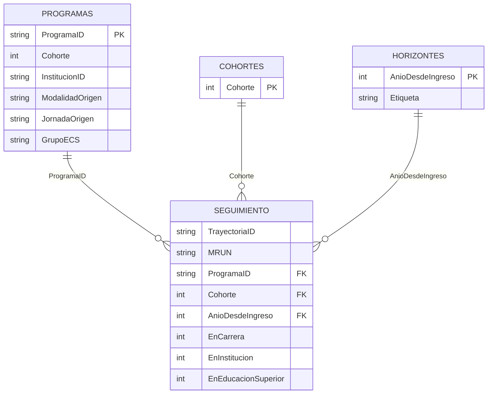

# 02 · Modelo semántico y metodología

## Propósito y granularidad

El modelo responde si una trayectoria de matrícula de origen permanece en su carrera, institución o en educación superior en un año posterior. La tabla `Seguimiento` tiene una fila por combinación de trayectoria y año observado. La unidad principal de cálculo es `TrayectoriaID`; las medidas complementarias de personas usan `MRUN` enmascarado.

La cohorte se fija en el año de matrícula de origen. `AnioDesdeIngreso = AnioObservado - Cohorte + 1`; por eso el valor 2 representa el seguimiento al año siguiente del ingreso.

## Universo

Se incluyen carreras de pregrado de IP y CFT cuando en el registro de origen se cumple al menos una de estas condiciones:

```text
ModalidadOrigen ∈ {No Presencial, Semipresencial}
OR JornadaOrigen = A Distancia
```

El resultado de la unión se deduplica a nivel de trayectoria. `AmbitoFlexible` conserva la explicación de inclusión. No se excluye un segmento por ser comparativamente pequeño.

## Definiciones operacionales

| Concepto | Numerador | Denominador | Clave |
|---|---|---|---|
| Retención académica | `EnCarrera = 1` | trayectorias observables de cohorte/horizonte | `TrayectoriaID` |
| Retención institucional | `EnInstitucion = 1` | mismo denominador | `TrayectoriaID` |
| Retención en educación superior | `EnEducacionSuperior = 1` | mismo denominador | `TrayectoriaID` |
| Titulación acumulada | `TituladoAcumulado = 1` | mismo denominador | `TrayectoriaID` |
| Personas en institución | `EnInstitucion = 1` | personas observables | `MRUN` |
| Personas en educación superior | `EnEducacionSuperior = 1` | personas observables | `MRUN` |

La bandera `Observable` forma parte del archivo analítico, pero las medidas actuales no agregan un filtro explícito `Observable = 1`. La construcción de las filas y el horizonte disponible actúan como delimitación. Cualquier cambio a esa regla requiere prueba de conciliación y ADR.

## Inventario de tablas

| Tabla | Rol | Filas auditadas | Columnas | Medidas | Origen |
|---|---|---:|---:|---:|---|
| `Seguimiento` | Hecho longitudinal | 1.634.184 | 13 | 20 | `seguimiento_*.csv.gz` |
| `Programas` | Dimensión de programa de origen | 3.152 | 14 | 0 | `programas.csv` |
| `Cohortes` | Dimensión de cohorte | 15 | 1 | 0 | `cohortes.csv` |
| `Horizontes` | Dimensión de año desde ingreso | 15 | 2 | 0 | `horizontes.csv` |

Los conteos corresponden al corte documentado matrícula 2025/titulados 2024. Deben recalcularse al cambiar los datos.

## Otros objetos semánticos

| Objeto | Estado observado |
|---|---|
| Jerarquías | Ninguna |
| Columnas calculadas | Ninguna |
| Tablas calculadas | Ninguna |
| Roles RLS | Ninguno |
| OLS | Ninguno |
| Grupos de cálculo | Ninguno |
| Cultura | `es-CL` |
| Perspectivas | Ninguna documentada |

La ausencia de roles es deliberada para datos abiertos en el alcance actual. La ausencia de grupos de cálculo es adecuada mientras no exista una familia compleja de transformaciones comunes; introducirlos solo para reducir unas pocas medidas aumentaría complejidad.

## Diccionario de columnas

### Seguimiento

| Columna | Tipo | Descripción | Visibilidad |
|---|---|---|---|
| `MRUN` | texto | Identificador enmascarado abierto de SIES; no es RUT | Oculta |
| `TrayectoriaID` | texto | Identificador derivado de la trayectoria de origen | Oculta |
| `ProgramaID` | texto | Clave del programa de origen | Oculta |
| `Cohorte` | entero | Año de ingreso/origen | Visible |
| `AnioObservado` | entero | Año de matrícula observado | Visible |
| `AnioDesdeIngreso` | entero | Horizonte ordinal desde el ingreso | Visible |
| `Observable` | entero 0/1 | Indica que el horizonte puede observarse en el corte | Visible técnica |
| `EnCarrera` | entero 0/1 | Matrícula en carrera de origen | Visible técnica |
| `EnInstitucion` | entero 0/1 | Matrícula en institución jurídica de origen | Visible técnica |
| `EnEducacionSuperior` | entero 0/1 | Matrícula en cualquier IES | Visible técnica |
| `EnECS` | entero 0/1 | Matrícula observada en el ámbito ECS | Visible técnica |
| `MovilidadInternaECS` | entero 0/1 | Cambio interno hacia/entre programas ECS según regla materializada | Visible técnica |
| `TituladoAcumulado` | entero 0/1 | Titulación registrada hasta el año observado | Visible técnica |

### Programas

| Columna | Tipo | Descripción |
|---|---|---|
| `ProgramaID` | texto | Clave única de programa/cohorte usada en la relación |
| `Cohorte` | entero | Cohorte del programa de origen |
| `InstitucionID` | texto | Clave normalizada de institución jurídica |
| `Institucion` | texto | Nombre de institución |
| `TipoInstitucion` | texto | IP o CFT |
| `CodigoCarrera` | texto | Código de carrera informado/normalizado |
| `Carrera` | texto | Nombre de carrera |
| `Nivel` | texto | Nivel de programa |
| `Area` | texto | Área de conocimiento |
| `ModalidadOrigen` | texto | Modalidad en matrícula de origen |
| `JornadaOrigen` | texto | Jornada en matrícula de origen |
| `AmbitoFlexible` | texto | Motivo de pertenencia al universo flexible |
| `GrupoECS` | texto | Clasificación `ECS` u otra usada en la página dedicada |
| `RegistrosOrigen` | entero | Número de registros consolidados en el programa |

`Cohortes[Cohorte]` contiene los 15 años de cohorte. `Horizontes[AnioDesdeIngreso]` contiene los 15 horizontes y `Horizontes[Etiqueta]` su rótulo de presentación.

## Diagrama de relaciones



## Matriz de relaciones

| Desde (muchos) | Hacia (uno) | Cardinalidad | Filtro | Activa | Integridad | Evaluación |
|---|---|---|---|---|---|---|
| `Seguimiento[ProgramaID]` | `Programas[ProgramaID]` | N:1 inferida por TMDL | Unidireccional dimensión→hecho | Sí | No declarada | [OK] |
| `Seguimiento[Cohorte]` | `Cohortes[Cohorte]` | N:1 inferida | Unidireccional | Sí | No declarada | [OK] |
| `Seguimiento[AnioDesdeIngreso]` | `Horizontes[AnioDesdeIngreso]` | N:1 inferida | Unidireccional | Sí | No declarada | [OK] |

TMDL omite propiedades cuando usa valores predeterminados. Las pruebas deben confirmar unicidad del lado uno, ausencia de huérfanos y tipos compatibles; no se debe confiar solo en la inferencia del archivo.

## Evaluación del esquema

- [OK] Esquema estrella compacto: tres dimensiones filtran una tabla de hechos.
- [OK] No hay relaciones N:N, bidireccionales, inactivas o circulares.
- [OK] No hay tablas calculadas, columnas calculadas ni tablas desconectadas.
- [NO APLICA] No se requiere tabla calendario para el horizonte ordinal actual.
- [RIESGO] `Programas` contiene `Cohorte`, pero la cohorte también se relaciona directamente con el hecho. No genera ambigüedad porque `Programas[Cohorte]` no se relaciona con `Cohortes`; debe mantenerse así o rediseñarse conscientemente.
- [RIESGO] Las columnas bandera técnicas están visibles; pueden inducir agregaciones incorrectas en autoservicio. Se recomienda ocultarlas y exponer solo medidas certificadas.
- [FALTA] Descripciones formales de tablas/columnas en TMDL.

## ECS

La página ECS no constituye otro modelo: filtra `Programas[GrupoECS] = "ECS"` mediante medidas dedicadas. Para el control cohorte 2024/horizonte 2:

| Indicador ECS | Numerador | Tasa |
|---|---:|---:|
| Base | 1.697 | — |
| Carrera | 1.137 | 67,0 % |
| Institución | 1.155 | 68,1 % |
| Educación superior | 1.266 | 74,6 % |

La clasificación ECS debe ser revisada por el responsable de negocio `responsables de negocio ECS` cuando cambie el catálogo de carreras.

## Reglas de cambio

1. No cambiar la granularidad sin una migración de medidas y conciliación completa.
2. No reemplazar `MRUN` por RUT ni eliminarlo de los datos reproducibles.
3. No crear relaciones bidireccionales para resolver un visual; diagnosticar primero el modelado.
4. Toda nueva relación requiere pruebas de unicidad, huérfanos, nulos y propagación.
5. Toda modificación del universo requiere nuevo resultado de control, actualización de manifiestos y ADR.
