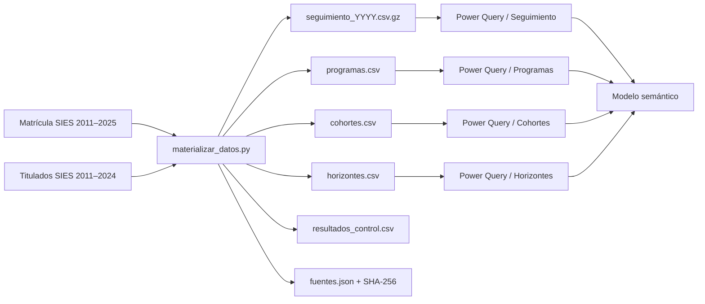

# 04 · Fuentes, Power Query y materialización

## Linaje



## Fuentes

Se usan bases abiertas del Centro de Estudios Mineduc/SIES:

- Matrícula de educación superior 2011–2025.
- Titulados de educación superior 2011–2024.

`datos/fuentes.json` registra los 29 archivos oficiales usados, año, filas, tamaño y SHA-256. `datos/archivos_analiticos.sha256` permite verificar los derivados. Las fuentes brutas no se incluyen en Git y deben descargarse desde el [portal oficial de datos abiertos](https://centroestudios.mineduc.cl/datos-abiertos/).

## Parámetro

`expressions.tmdl` define:

```tmdl
expression 'Ruta datos' = "C:\ruta\absoluta\al\proyecto\datos"
    meta [IsParameterQuery=true, Type="Text", IsParameterQueryRequired=true]
```

`scripts/configurar_ruta_datos.py` resuelve automáticamente `datos/` como ruta absoluta de la copia actual sin reemplazar otras definiciones normalizadas por Power BI Desktop. Puede recibir otra carpeta como argumento. El generador completo también admite `PBIP_DATA_PATH`. Al mover o clonar el proyecto se debe volver a configurar el parámetro.

## Consultas M

| Partición | Entrada | Operaciones principales |
|---|---|---|
| `Seguimiento` | `seguimiento_*.csv.gz` | `Folder.Files`, filtro de nombres, GZip, CSV `;`, promoción, combinación, tipos |
| `Programas` | `programas.csv` | `File.Contents`, CSV `;`, promoción, tipos |
| `Cohortes` | `cohortes.csv` | lectura CSV y tipos |
| `Horizontes` | `horizontes.csv` | lectura CSV y tipos |

Los archivos usan UTF-8 (`Encoding=65001`) y delimitador punto y coma. El uso de `Folder.Files` para seguimiento exige que la carpeta no contenga archivos con el mismo patrón y esquema incompatible.

## Reconstrucción

Estructura bruta esperada:

```text
datos_fuente/
├── Matricula-Ed-Superior-2011/
├── ...
├── Matricula-Ed-Superior-2025/
├── Titulados-Ed-Superior-2011/
├── ...
└── Titulados-Ed-Superior-2024D/
```

Los nombres exactos encontrados se registran en `datos/fuentes.json`; el script es la autoridad frente a variaciones del portal.

```powershell
python scripts/materializar_datos.py --source-root datos_fuente --output datos
```

Entrada alternativa:

```text
artifacts/silver/source=matricula/year=AAAA/data.parquet
artifacts/silver/source=titulados/year=AAAA/data.parquet
```

## Controles de calidad

- Cobertura de todos los años requeridos.
- Esquema mínimo y tipos convertibles.
- `MRUN` tratado como texto y nunca renombrado `RUT`.
- Claves `ProgramaID` y `TrayectoriaID` no nulas donde corresponda.
- Unicidad del lado uno de relaciones.
- Banderas limitadas a 0/1.
- Coherencia esperada: carrera ⊆ institución ⊆ educación superior.
- Hashes recalculados después de cada materialización.
- Conciliación con `resultados_control.csv`.
- Revisión de conteos y variaciones interanuales atípicas.

## Privacidad y publicación

Aunque `MRUN` sea enmascarado y abierto, no debe mostrarse como dimensión de reporte ni combinarse con datos privados. Se conserva en el CSV por reproducibilidad. Los archivos fuente se excluyen para evitar duplicación, tamaño innecesario y redistribución no evaluada; los derivados necesarios sí se versionan con licencia y linaje.

## Oportunidades de mejora

1. Agregar validación formal de esquema por año y reporte de drift.
2. Incorporar prueba automática de todos los SHA-256 analíticos en CI.
3. Evaluar buffering solo con evidencia; puede aumentar memoria y no mejora siempre.
4. Evaluar particiones incrementales si crece el volumen, preservando el patrón de archivos.
5. Registrar duración, filas de entrada/salida y versión de librerías en un manifiesto de ejecución.
