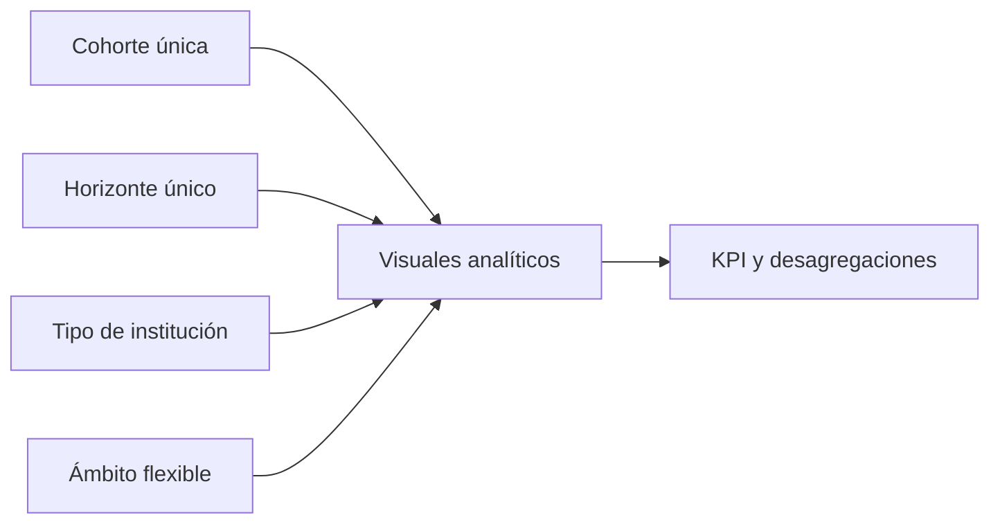

# 05 · Reporte

## Estado auditado

El reporte 3.1.0 contiene siete páginas y **73 visuales con identificadores únicos**. Las tres colisiones históricas fueron corregidas en el generador; se cierra **REPORT-001**.

## Inventario de páginas

| Orden | Página | Propósito | Visuales |
|---:|---|---|---:|
| 1 | Resumen nacional | KPI y comparación general | 13 |
| 2 | Cohortes | Evolución por cohorte/horizonte | 8 |
| 3 | Instituciones | Comparación por institución | 8 |
| 4 | Modalidad y jornada | Segmentos del universo flexible | 9 |
| 5 | ECS | Comportamiento específico de la escuela | 12 |
| 6 | Titulación | Titulación acumulada | 11 |
| 7 | Metodología | Definiciones, alcance y MRUN | 12 |
|  | **Total** |  | **73** |

## Filtros y contexto

Las seis páginas analíticas tienen cuatro segmentadores: cohorte, horizonte, tipo de institución y ámbito flexible. Cohorte y horizonte son de selección única. El valor inicial es cohorte 2024 —excepto en la página Cohortes— y horizonte 2. Las medidas muestran blanco ante un contexto inválido y `Estado selección` explica al usuario qué debe escoger.

## Página ECS

La página ECS muestra base, retención en carrera, retención institucional, continuidad en educación superior y movilidad interna. `GrupoECS` proviene del catálogo materializado y conserva separadas las instituciones jurídicas 171 y 426. Para cohorte 2024/horizonte 2, los controles son 1.697, 1.137, 1.155 y 1.266 respectivamente.

## Controles automatizados

- Siete páginas en orden y 73 `visual.json`.
- Cero identificadores de visual repetidos.
- Posiciones dentro del lienzo 1600 × 900.
- Todas las referencias de columnas y medidas existen en TMDL.
- 24 segmentadores en las seis páginas analíticas.
- 12 segmentadores estrictos de cohorte/horizonte; valores iniciales verificados.

## Validación operativa antes de publicar

1. Abrir y actualizar el PBIP sin mensajes de reparación.
2. Revisar títulos, orden de tabulación, contraste y textos alternativos.
3. Confirmar que cohorte/horizonte no admitan selección múltiple.
4. Comparar tarjetas con `datos/resultados_control.csv`.
5. Verificar ECS 2024/horizonte 2 y ejecutar Performance Analyzer.
6. Confirmar que MRUN no aparezca en visuales ni drill-through.

La validación estática y numérica está cerrada; la inspección visual en Power BI Desktop sigue siendo un control operativo previo a una publicación formal.
