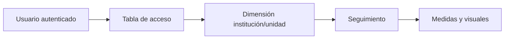

# 06 · Seguridad, RLS y OLS

## Clasificación de información

| Activo | Clasificación del proyecto | Regla |
|---|---|---|
| Fuentes SIES descargadas | Datos abiertos de origen | No se redistribuyen automáticamente desde este repo |
| CSV analíticos | Datos abiertos derivados | Se versionan por reproducibilidad y conservan linaje |
| `MRUN` | Identificador enmascarado técnico | Se conserva en datos; se oculta en modelo/reporte |
| `TrayectoriaID` | Identificador derivado | Oculto; no usar como atributo de negocio |
| DAX/TMDL/PBIR | Código y metadatos | Revisión por pull request |
| Tenant, workspace, secretos | Configuración sensible | Nunca versionar; usar GitHub Secrets/Environments |

`MRUN` no es el RUT real. Que sea abierto y enmascarado no autoriza intentos de reidentificación ni su combinación con bases privadas fuera del propósito documentado.

## Estado RLS/OLS

- Roles RLS: ninguno.
- Reglas DAX de seguridad: ninguna.
- OLS: ninguno.
- Relaciones bidireccionales con impacto de seguridad: ninguna.

Estado: **[NO APLICA para publicación abierta actual]**. No significa que el modelo sea apto para datos internos sin cambios.

## Cuándo pasa a ser obligatorio

RLS/OLS debe diseñarse antes de integrar:

- datos no públicos;
- atributos de personal, sede o unidad con acceso restringido;
- resultados individuales no destinados a publicación;
- usuarios con alcance institucional diferenciado;
- tablas auxiliares con información privada.

## Patrón recomendado si cambia el alcance

La tabla de acceso debe filtrar una dimensión, no directamente múltiples hechos. Evite seguridad dinámica basada en filtros bidireccionales sin una prueba formal de propagación.

## Matriz mínima de prueba RLS

| Caso | Resultado esperado |
|---|---|
| Usuario autorizado para una institución | Solo esa institución y sus hechos |
| Usuario autorizado para varias | Unión exacta, sin duplicación |
| Usuario sin mapeo | Cero filas |
| Administrador controlado | Universo acordado, no bypass accidental |
| Totales y drill-through | Mismo alcance que el detalle |
| Exportación y Analyze in Excel | No amplía el acceso |

## Riesgos y controles

| Riesgo | Severidad | Control |
|---|---|---|
| Exponer MRUN en visual/exportación | Alta | Mantener oculto, revisar visuales y permisos de exportación |
| Publicar un secreto o ruta interna | Crítica | secret scanning, revisión y `.gitignore` |
| Suponer que “oculto” equivale a seguridad | Alta | documentar que ocultar no es OLS |
| Incorporar datos privados sin roles | Crítica | bloquear release y crear ADR de seguridad |
| Service principal con permisos amplios | Alta | mínimo privilegio y credenciales rotadas |
| Workflow modificado sin revisión | Alta | CODEOWNERS y branch protection |

## Respuesta a incidentes

1. Suspender despliegue o acceso afectado.
2. Rotar credenciales expuestas.
3. Determinar si el dato estuvo disponible en clones/historial.
4. Seguir el proceso organizacional de notificación.
5. Corregir y agregar prueba preventiva.
6. Documentar la decisión sin incluir el secreto.

El canal operativo se define en [SECURITY.md](../SECURITY.md) y sigue pendiente hasta reemplazar sus placeholders.
