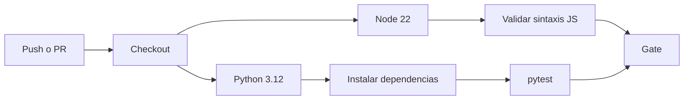

# 07 · ALM y DevOps

## Estado actual

| Capacidad | Estado | Evidencia |
|---|---|---|
| Control de versiones PBIP | [OK local] | estructura de texto completa |
| CI | [OK] | `.github/workflows/validar.yml` |
| Pruebas Python | [OK] | `tests/` |
| Validación JavaScript | [OK parcial] | sintaxis de generadores |
| Revisión por propietarios | [FALTA configuración] | `CODEOWNERS` contiene placeholders |
| Protección de `main` | [FALTA configuración GitHub] | no verificable localmente |
| Entornos DEV/TEST/PROD | [PROPUESTO] | identificadores pendientes |
| CD a Fabric/Power BI | [NO IMPLEMENTADO] | no hay workflow de despliegue |
| BPA/Tabular Editor | [PROPUESTO] | requiere herramienta/licencia acordada |
| Pruebas DAX Studio | [MANUAL PENDIENTE] | plan definido en auditoría |

## Estrategia Git recomendada

- Rama principal: `main`, protegida.
- Ramas breves: `feature/*`, `fix/*`, `docs/*`, `data/*`.
- Commits: Conventional Commits.
- Integración: pull request y squash merge.
- Versiones: SemVer y tag `vMAJOR.MINOR.PATCH`.
- Release: adjuntar notas, corte de datos, hashes y limitaciones conocidas.

GitHub permite requerir checks y revisiones mediante protected branches/rulesets: [About protected branches](https://docs.github.com/en/repositories/configuring-branches-and-merges-in-your-repository/managing-protected-branches/about-protected-branches). CODEOWNERS solicita revisores cuando los propietarios válidos tienen acceso de escritura: [About code owners](https://docs.github.com/en/repositories/managing-your-repositorys-settings-and-features/customizing-your-repository/about-code-owners).

## Protección de `main`

Configuración recomendada:

1. Requerir pull request.
2. Requerir al menos una aprobación y aprobación de Code Owner.
3. Descartar aprobaciones al ingresar nuevos commits.
4. Requerir el check único `validar / validar`.
5. Exigir resolución de conversaciones.
6. Bloquear force-push y eliminación.
7. Restringir bypass a administradores designados.
8. Aplicar el mismo control a cambios de `.github/` y `CODEOWNERS`.

## CI vigente



CI debe validar sintaxis de ambos scripts JavaScript, pruebas de reproducibilidad, estructura PBIP, documentación, enlaces locales, placeholders críticos y tamaños.

## Entornos propuestos

| Entorno | Rama/tag | Workspace | Datos | Aprobación |
|---|---|---|---|---|
| DEV | ramas/`main` | `workspace DEV por definir` | corte de desarrollo | `responsables de desarrollo` |
| TEST | release candidate | `workspace TEST por definir` | réplica controlada | `responsables de QA` |
| PROD | tag `v*` | `workspace PROD por definir` | corte liberado | `responsables de producción` |

Ninguno de estos destinos ha sido verificado; son placeholders, no infraestructura existente.

## CD propuesto, no autorizado aún

```mermaid
flowchart LR
  TAG[Tag firmado v*] --> CI[CI completo]
  CI --> DEV[Desplegar DEV]
  DEV --> SMOKE[Pruebas smoke]
  SMOKE --> APPROVE[Aprobación QA/negocio]
  APPROVE --> TEST[Desplegar TEST]
  TEST --> APPROVE2[Aprobación producción]
  APPROVE2 --> PROD[Desplegar PROD]
  PROD --> VERIFY[Validar refresh y resultados]
```



Opciones oficiales:

- Fabric Git integration para sincronizar workspaces con repositorios: [Get started with Git integration](https://learn.microsoft.com/en-us/fabric/cicd/git-integration/git-get-started).
- `fabric-cicd` para desplegar elementos PBIP desde automatización: [Deploy using fabric-cicd](https://learn.microsoft.com/en-us/power-bi/developer/projects/projects-deploy-fabric-cicd).
- API de deployment pipelines para promoción entre etapas: [Automate deployment pipelines](https://learn.microsoft.com/en-us/fabric/cicd/deployment-pipelines/pipeline-automation).

La elección requiere confirmar licenciamiento, tenant, capacidad, workspaces, identidad de servicio y política organizacional. No se crea un workflow de CD hasta disponer de esos datos y autorización.

## Parámetros y secretos

| Valor | Almacenamiento |
|---|---|
| Ruta local de datos | Parámetro Power Query absoluto generado por entorno; debe regenerarse después de clonar o mover |
| Tenant/client/secret | GitHub Environment secrets o identidad federada |
| Workspace IDs | Variables de Environment, no código si son internos |
| Aprobadores | Protección del Environment |
| Corte de datos | `pbip.manifest.json` y release notes |

Preferir OpenID Connect/identidad federada cuando el entorno lo permita, evitando secretos de larga duración.

## Validaciones futuras

- Tabular Editor Best Practice Analyzer sobre TMDL/modelo.
- DAX Studio Server Timings y VertiPaq Analyzer.
- Performance Analyzer de Desktop con casos de usuario.
- validación de esquema PBIR/TMDL con herramienta compatible;
- smoke test posdespliegue y actualización;
- comparación automatizada de resultados de control por entorno.

## Git LFS

Decisión actual: no usar. Los archivos están bajo 100 MiB y el repositorio completo es pequeño. Si un archivo crece, evaluar primero particionar, comprimir o regenerar; LFS se adopta solo mediante ADR, considerando cuotas y experiencia de clonación. Referencia: [About Git Large File Storage](https://docs.github.com/en/repositories/working-with-files/managing-large-files/about-git-large-file-storage).

Ejemplo de `.gitattributes` **solo si un ADR futuro aprueba LFS**:

```gitattributes
*.parquet filter=lfs diff=lfs merge=lfs -text
*.pbix filter=lfs diff=lfs merge=lfs -text
```

Estas reglas no deben copiarse al archivo activo mientras los derivados comprimidos sigan siendo pequeños y el PBIP sea la fuente del proyecto.

Ejemplo no activo para una futura decisión de versionar Parquet mediante LFS:

```gitattributes
*.parquet filter=lfs diff=lfs merge=lfs -text
```

No copie esa regla al `.gitattributes` actual sin aprobar el ADR y migrar correctamente los archivos ya rastreados.

## Plan de publicación en GitHub

1. Reemplazar los placeholders de organización, repositorio, propietarios y contacto de seguridad.
2. Confirmar la versión de Power BI Desktop con una apertura y actualización completas.
3. Verificar que las pruebas de regresión de DAX-001 y REPORT-001 permanezcan en verde.
4. Crear un repositorio vacío `repositorio de destino` bajo `organización de destino`.
5. Inicializar Git dentro de esta carpeta, no en su directorio padre:

```powershell
cd retencion-academica-sies
git init -b main
git add .
git commit -m "chore: publica PBIP reproducible y gobernado"
git remote add origin $repoUrl
git push -u origin main
```

6. Configurar los equipos usados en `.github/CODEOWNERS` y concederles escritura.
7. Activar branch protection/ruleset con PR, aprobación de Code Owner y check `validar`.
8. Habilitar Issues, reporte privado de vulnerabilidades y secret scanning según el plan disponible.
9. Crear el tag de versión sólo después del checklist de release y publicar notas con corte y riesgos.
10. Diseñar CD en un PR separado cuando existan workspaces, identidad y aprobaciones.

La carpeta se encuentra actualmente sin seguimiento dentro de un repositorio padre y no tiene remoto GitHub configurado. Crear el remoto o hacer `push` es una acción externa que debe ejecutar o autorizar el propietario.

## Información pendiente

- `organización de destino` y `repositorio de destino`.
- Cuentas/equipos para todos los Code Owners.
- Power BI Desktop 2.157.1354.0 (August 2026), validado para esta entrega.
- Contacto y canal privado de seguridad.
- Workspaces DEV/TEST/PROD, capacidad/licencia y tenant.
- Identidad de despliegue y mecanismo de autenticación.
- Convenciones organizacionales que sustituyan o aprueben las recomendadas.
