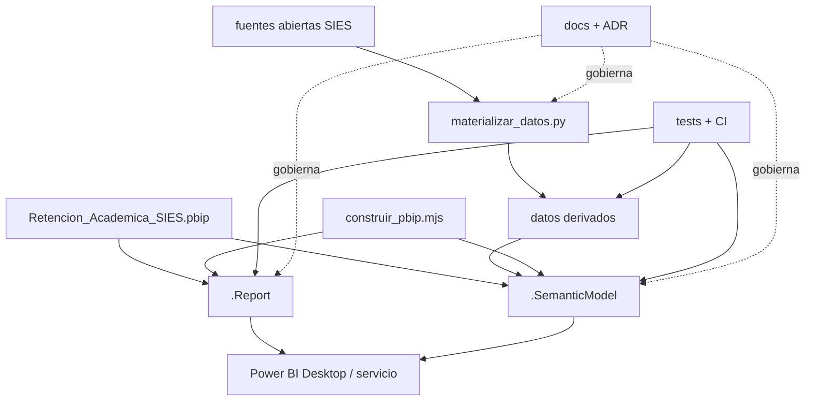

# Documentación del proyecto

Este directorio es la fuente de verdad documental del PBIP. Los archivos TMDL/JSON son la fuente ejecutable; cuando una afirmación documental contradiga el proyecto, se debe corregir la documentación o registrar la decisión, nunca ocultar la diferencia.

## Mapa de lectura

| Documento | Propósito | Audiencia | Estado |
|---|---|---|---|
| [00 · Introducción](00-introduccion.md) | Conceptos, alcance y límites de PBIP | Todo público | Vigente |
| [01 · Estructura PBIP](01-estructura-pbip.md) | Anatomía real del repositorio | Desarrollo, DevOps | Vigente |
| [02 · Modelo semántico](02-modelo-semantico.md) | Universo, granularidad, tablas, relaciones y reglas | Datos, negocio, QA | Vigente |
| [03 · DAX](03-dax.md) | Inventario, convenciones, dependencias y controles | BI, QA | Auditado 3.1.0 |
| [04 · Power Query](04-power-query.md) | Fuentes, parámetros, materialización y linaje | Datos, BI | Vigente |
| [05 · Reporte](05-reporte.md) | Páginas, visuales, interacción y ECS | BI, negocio, QA | Auditado 3.1.0 |
| [06 · Seguridad](06-seguridad.md) | Clasificación, MRUN, RLS/OLS y pruebas | Seguridad, BI | Vigente |
| [07 · ALM y DevOps](07-alm-devops.md) | Git, CI/CD, entornos y releases | Desarrollo, DevOps | CI vigente; CD propuesto |
| [08 · Estándares](08-estandares.md) | Nombres, formato y revisión | Contribuidores | Vigente |
| [09 · Glosario](09-glosario.md) | Términos de negocio y técnicos | Todo público | Vigente |
| [10 · ADR](10-adr/README.md) | Decisiones de arquitectura | Gobierno técnico | Vigente |
| [11 · Checklists](11-checklists.md) | Controles de commit, PR y release | Desarrollo, QA | Vigente |

Complementos:

- [Auditoría técnica completa](../AUDITORIA_MODELO_SEMANTICO.md).
- [Auditoría numérica vigente](../AUDITORIA_NUMERICA_COMPLETA.md).
- [Informe ejecutivo para el vicerrector ECS](../INFORME_VICERRECTOR_ECS.md).
- [Procedencia IPLACEX](../ANALISIS_PROCEDENCIA_PRIMER_ANO_IPLACEX.md).
- [Validación reproducible](../VALIDACION.md).
- [Manifiesto de documentación](documentacion-manifest.yml).

## Arquitectura del repositorio

## Reglas de actualización

1. Un cambio funcional actualiza el documento especializado y, si afecta alcance, también el README raíz.
2. Una decisión transversal genera ADR.
3. Una liberación actualiza `CHANGELOG.md`, `pbip.manifest.json` y la fecha de este manifiesto.
4. Los hechos se respaldan con una ruta del repositorio; las recomendaciones se etiquetan como tales.
5. Los placeholders se rastrean como deuda de gobierno y no se confunden con configuración real.
